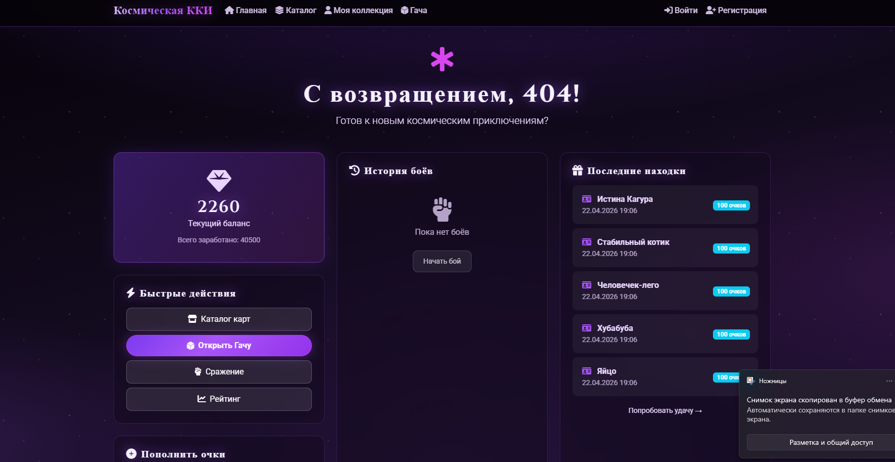
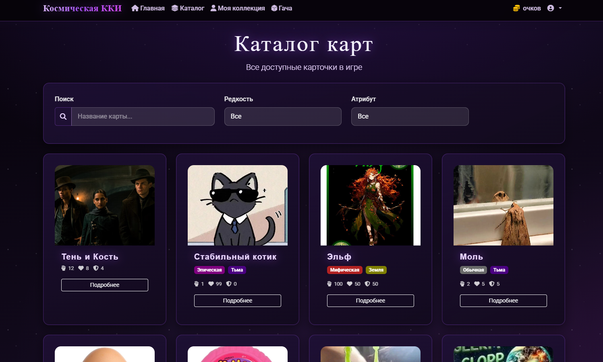
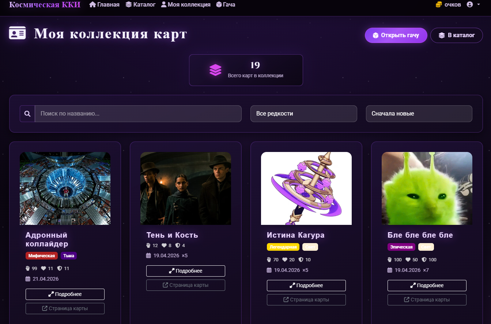
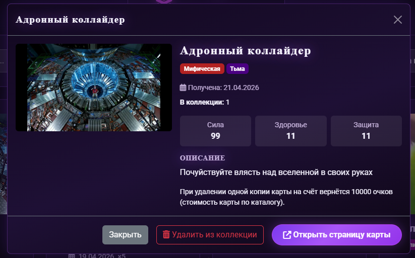
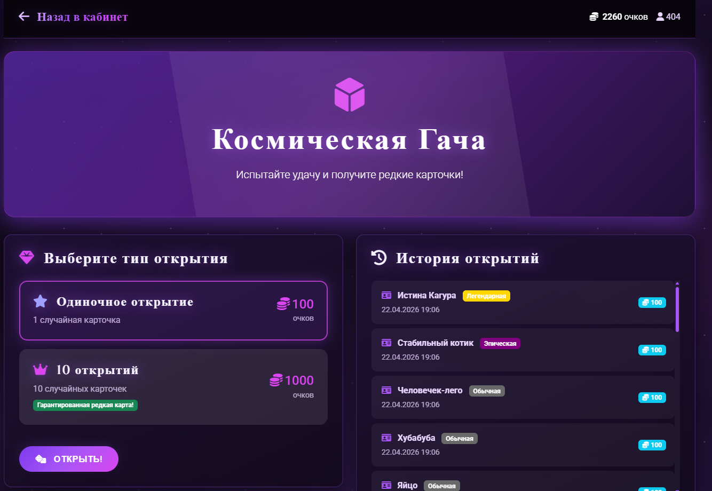

# Astra

Astra - это веб-приложение на Django с механиками коллекционирования карточек: регистрация пользователей, каталог карт, гача-открытия, личная коллекция и базовая статистика в личном кабинете.

## Основной функционал

В приложении вы можете:

- зарегистрироваться и войти в аккаунт;
- получать стартовые очки и пополнять их в личном кабинете;
- выбивать свои карточки в гаче:
  - 1 открытие за 100 очков;
  - 10 открытий за 1000 очков;
  - шанс выпадения зависит от редкости карточки;
- создавать свои карточки (название, описание, характеристики, редкость, атрибут, изображение);
- смотреть каталог всех активных карточек с фильтрами и поиском;
- открывать страницу каждой карточки с подробной информацией;
- собирать личную коллекцию и хранить в ней полученные карточки;
- фильтровать коллекцию по редкости, атрибуту и избранному;
- удалять карточки из инвентаря и возвращать за них очки;
- видеть свою статистику в `dashboard`:
  - сколько карт в коллекции;
  - сколько избранных и экипированных;
  - последние открытия гачи;
  - текущий и общий баланс очков.

## Что уже заложено в проект

- Модели домена:
  - `Attribute` (атрибут/стихия карты),
  - `Rarity` (редкость + множитель выпадения),
  - `Cards`,
  - `User_Inventory`,
  - `Gacha_History`,
  - `Battle_History`.
- Загрузка медиа (обложки карт и иконки атрибутов) через `MEDIA_ROOT`.
- Подготовленная Docker-инфраструктура:
  - контейнер Django + Gunicorn;
  - отдельный контейнер Nginx;
  - тома для БД, статики и медиа.

## Стек

- Python 3.12
- Django 6
- SQLite
- Gunicorn
- Nginx
- Docker / Docker Compose

## Быстрый старт (локально, без Docker)

1. Перейдите в директорию приложения:

   ```bash
   cd Astra
   ```

2. Создайте и активируйте виртуальное окружение:

   ```bash
   python -m venv venv
   venv\Scripts\activate
   ```

3. Установите зависимости:

   ```bash
   pip install -r requirements.txt
   ```

4. Примените миграции:

   ```bash
   python manage.py migrate
   ```

5. Запустите сервер:

   ```bash
   python manage.py runserver
   ```

После запуска приложение будет доступно по адресу: `http://127.0.0.1:8000/`.

## Запуск через Docker Compose

Из корня проекта:

```bash
docker compose -f Astra/compose.yaml up --build
```

По умолчанию внешний порт задается через `HOST_PORT` (в `.env`), например `8001`.

## Структура проекта

- `Astra/` - директория Django-приложения и инфраструктуры.
- `Astra/Astra/` - конфигурация проекта (`settings.py`, `urls.py`, `wsgi.py`).
- `Astra/module_project/` - основное приложение (модели, вьюхи, формы, маршруты).
- `Astra/module_project/templates/` - HTML-шаблоны.
- `Astra/module_project/static/` - стили и JS.
- `Astra/nginx/` - конфигурация Nginx для контейнера.

## Переменные окружения

Ключевые настройки, используемые проектом:

- `DJANGO_DEBUG`
- `DJANGO_SECRET_KEY`
- `DJANGO_DB_PATH`
- `DJANGO_ALLOWED_HOSTS`
- `DJANGO_CSRF_TRUSTED_ORIGINS`
- `HOST_PORT`

## Примечание по аутентификации

Сейчас в проекте используется собственная модель пользователя (`Users_System`) и сессионная авторизация, а не стандартная `django.contrib.auth.User`.

***

## Демонстрация работы 










